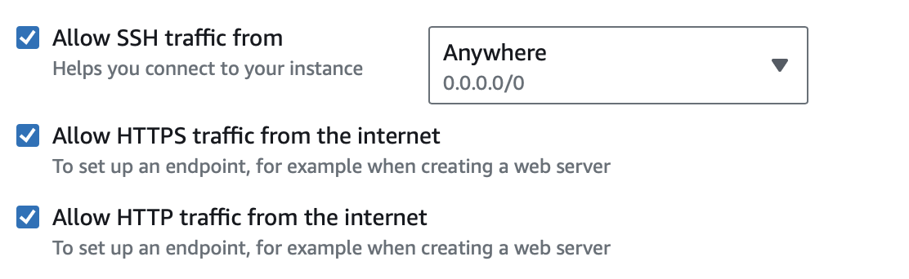

<a name="readme-top"></a>


<!-- PROJECT LOGO -->
<br />
<div align="center">
  <a href="https://github.com/faserely/faserely">
    
  </a>
</div>

<h3 align="center">Jordanian Sign Language Translation System</h3>


<!-- TABLE OF CONTENTS -->
<details>
  <summary>Table of Contents</summary>
  <ol>
    <li>
      <a href="#about-the-project">About The Project</a>
      <ul>
        <li><a href="#built-with">Built With</a></li>
      </ul>
    </li>
    <li>
      <a href="#getting-started">Getting Started</a>
      <ul>
        <li><a href="#prerequisites">Prerequisites</a></li>
        <li><a href="#installation">Installation</a></li>
      </ul>
    </li>
    <li>
      <a href="#data-loading-and-processing">Data Loading and Processing</a>
    </li>
    <li>
      <a href="#training">Training</a>
    </li>
    <li>
      <a href="#web-interface">Web Interface</a>
    </li>
    <li>
      <a href="#usage">Usage</a>
    </li>
    <li>
      <a href="#contact">Contact</a>
    </li>
  </ol>
</details>


<!-- ABOUT THE PROJECT -->
## About The Project

Faserely is an innovative Jordanian sign language translation web page designed to assist deaf and hard-of-hearing individuals. It functions as an end-to-end solution, meaning it covers all aspects of translation from initial input to final output in sign language. This comprehensive approach ensures effective communication for its users, addressing the specific challenges faced by the deaf and hard-of-hearing community in Jordan. By focusing on Jordanian Sign Language, Faserely caters to the unique linguistic needs of its target audience, making it a specialized and valuable tool.

In this Git Repository you will learn how to make your own Faserely

### Built With

* [![Python][python]][python-url]
* [![AWS][aws]][aws-url]
* [![Docker][docker]][docker-url]
* [![HTML][html]][html-url]
* [![CSS][css]][css-url]
* [![Javascript][javascript]][javscript-url]


<p align="right">(<a href="#readme-top">back to top</a>)</p>


<!-- GETTING STARTED -->
## Getting Started


### Prerequisites

* install python
  ```sh
    https://www.python.org/downloads/
  ```

* install aws cli sdk
  ```sh
  curl "https://awscli.amazonaws.com/AWSCLIV2.pkg" -o "AWSCLIV2.pkg"
  sudo installer -pkg AWSCLIV2.pkg -target/
  ```
* install docker (refer to docker website for versions other than macOS)
  ```sh
   sudo hdiutil attach Docker.dmg
    sudo /Volumes/Docker/Docker.app/Contents/MacOS/install
    sudo hdiutil detach /Volumes/Docker
  ```

* install requirements in requirements.py
  ```sh
  pip install -r requirements.txt
    ```

<p align="right">(<a href="#readme-top">back to top</a>)</p>

## Data Loading and Processing
Due to ethical Issues the specific Data used in this project cannot be provided, in order to achieve the same results we recommend to follow this structure in data

```sh
MainFolder -> Alphabet Folders
              None Folder
              Space Folder
```


1 - Load your data in an Amazon S3 Bucket, and create a new bucket to host the processed data

2 - In Batch Config, config.json , put your AWS Credentials and Region in their respected places.

3 - In process_image.py update the bucket names in order to match your bucket names.

4 - Enter Batch Config Directory in CLI and build the docker image

```sh
cd Batch Config
docker build -t image_processing .
```
5 - Configure AWS CLI:
```sh
aws configure (enter same credentials used in config.json file)
aws ecr get-login-password --region us-east-1 | docker login --username AWS --password-stdin enter_ecr_docker_link_here
```
6 - Tag the image and push it to AWS ECR:

```sh
docker tag image_processing:latest enter_ecr_docker_link_here/image_processing:latest
docker push enter_ecr_docker_link_here/image_processing:latest
```

7 - Define a job and submit it in AWS Batch
```sh
aws batch define-job --cli-input-json file://batchjobdef.json
aws batch submit-job --cli-input-json file://batchjobsubmit.json
```

8 -  Monitor the Batch Job Created on AWS Cloud Watch

<p align="right">(<a href="#readme-top">back to top</a>)</p>

## Training

After Batch Job Completion your data is now ready to be processed.

1 - Create a Sagemaker Notebook instance fit to your need, for GPU the g5.xlarge instance is great as it contains A100G GPU and sufficient VCPU, VRAM for most jobs.

2 - Load ArSL.ipynb

3 - Recursive Import your Data as needed

4 - Change Data Path

5 - Run All Code cells, expect a long duration for dataset loading by gesture recognizer depending on the size of your dataset

<p align="right">(<a href="#readme-top">back to top</a>)</p>

## Web Interface

After your Model is ready and uploaded to an S3 Bucket, Change S3 Bucket settings to allow CORS, and Public Access

1 - Allow Public Access, Navigate to your S3 Bucket -> Permissions -> Allow Public Access -> Uncheck All Boxes

2 - Allow CORS, Navigate to your S3 Bucket -> Permissions -> Cross-origin resource sharing (CORS) -> Edit.

Paste the following policy
```sh
[
    {
        "AllowedHeaders": [
            "*"
        ],
        "AllowedMethods": [
            "GET"
        ],
        "AllowedOrigins": [
            "https://faserely.com",
            "https://www.faserely.com",
            "faserely.com",
            "www.faserely.com",
            "http://127.0.0.1:5500"
        ],
        "ExposeHeaders": []
    }
]
```

3 - Launch an EC2 Instance fit to your needs for GPU the g5.xlarge instance is great as it contains A100G GPU and sufficient VCPU, VRAM for most loads.

<p align="center">
  
</p>

4 - Select Ubuntu as your OS and Generate a key pair

5 - Configure your EC2 to allow SSH, HTTP, and HTTPS
<p align="center">
  
</p>

6 - Associate a Elastic IP to your EC2
EC2 -> Elastic IP -> Allocate Elastic IP

<p align="center">
  
</p>

After allocating your Elastic IP, Associate it to your EC2 by
EC2 -> Elastic IP -> Actions -> Associate Elastic IP
<p align="center">
  
</p>
6 - Connect to your EC2 via SSH

```sh
chmod 400 add_dir_where_key_is_located/keyname.pem
ssh -i "add_dir_where_key_is_located/keyname.pem" ubuntu@ec2_url
```
7 - Run the following commands

```sh
sudo apt-get update && sudo apt-get upgrade
sudo apt install nginx
```
8 - Configure Nginx
```sh
cd /
cd etc/nginx/sites-enabled
```
Locate default file and have the same contents of nginx_config file

9 - Load Web Page Codes

```sh
cd var/www/html
```
In the html directory put the codes located in Front-End ensure same order and folder/file hierarchy
in translate.js change the model_path to match your model path from the S3 Created to Host your model.

Now the website should be available at your Elastic IP

10 - Configure Route53 if you intend to purchase a domain name

11 - Start a Host Zone, if you plan to buy domain from AWS, Route53 will be your DNS, if not, you need to update DNS fields in your Domain Name Host
<p align="center">
  
</p>
12 - In Route53, Route Traffic coming to your domain name to your Elastic IP

13 - The website functionality in asking user for their video feed ONLY Works in HTTPS, to route incoming traffic to HTTPS a load balancer has to be deployed

14 - Navigate to EC2 -> Target Group -> Create Target Group -> Add your EC2 Instance

15 - Navigate to EC2 -> Load Balancer

Create an Application Load Balancer -> in Listeners and Routing use Protocol HTTPS, Add your target Group
<p align="center">
  
</p>
16 - Navigate to Route53 and Delete Records Regarding Elastic IP Traffic Allocation, instead, allocate traffic to your Load Balancer. Your website should be HTTPS Now.
<p align="right">(<a href="#readme-top">back to top</a>)</p>


<!-- USAGE EXAMPLES -->
## Usage
For Usage, We recommend testing functionality Locally, then going to deployment using AWS, Test Each Component of the system locally, such as training, website in general, our model will be available all the time for testing, so you can play with it without deploying your actual models.

<p align="right">(<a href="#readme-top">back to top</a>)</p>

<!-- CONTACT -->
## Contact

Faserely PSUT - faserely@gmail.com

Project Link: [https://github.com/faserely/faserely](https://github.com/faserely/faserely)

<p align="right">(<a href="#readme-top">back to top</a>)</p>

[python]: https://img.shields.io/badge/Python-3776AB?style=for-the-badge&logo=python&logoColor=white
[python-url]: https://www.python.org
[docker]: https://img.shields.io/badge/Docker-2496ED?style=for-the-badge&logo=docker&logoColor=white
[docker-url]:http://docker.com
[html]:https://img.shields.io/badge/HTML-E34F26?style=for-the-badge&logo=html5&logoColor=white
[html-url]:https://html.spec.whatwg.org/
[aws]:https://img.shields.io/badge/AWS-232F3E?style=for-the-badge&logo=amazonaws&logoColor=white
[aws-url]: https://aws.amazon.com/
[css]:https://img.shields.io/badge/CSS-1572B6?style=for-the-badge&logo=css3&logoColor=white
[css-url]: https://www.w3.org/Style/CSS/Overview.en.html
[javascript]:https://img.shields.io/badge/JavaScript-F7DF1E?style=for-the-badge&logo=javascript&logoColor=black
[javscript-url]: https://www.ecma-international.org/publications-and-standards/standards/ecma-262/

